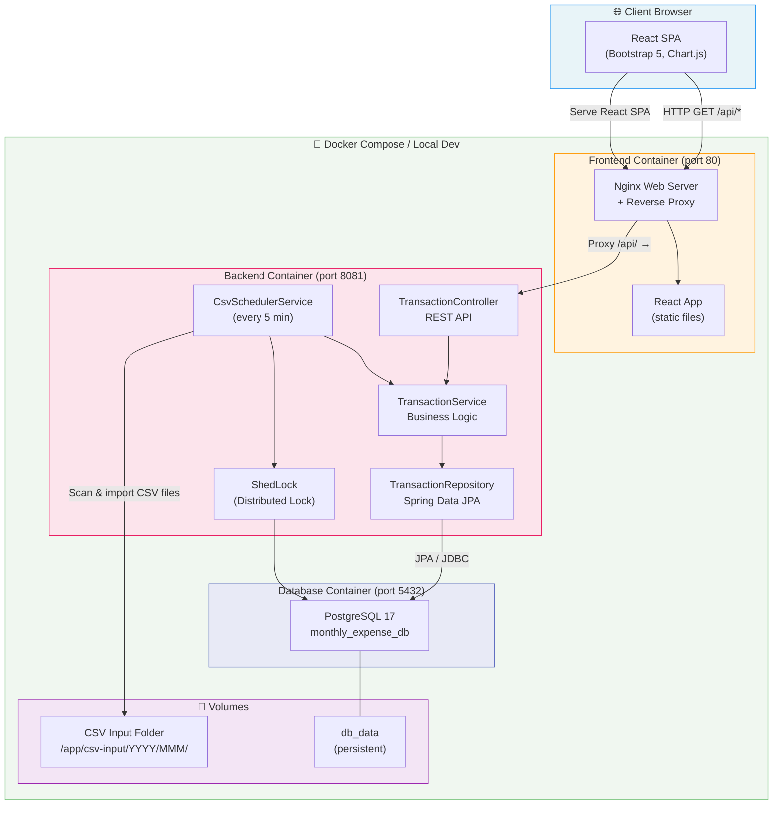
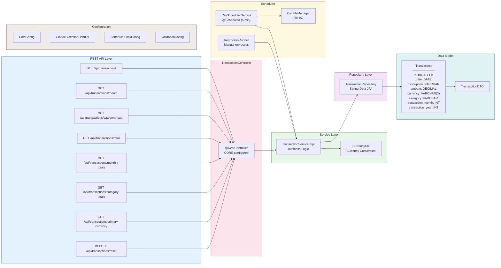
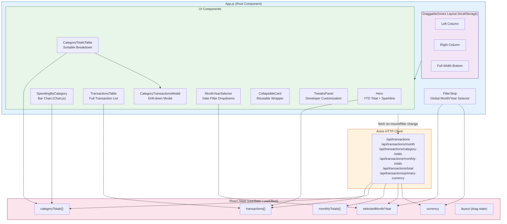
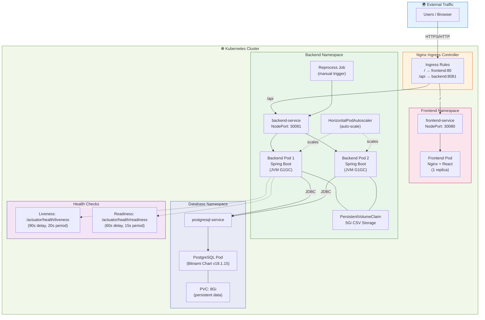
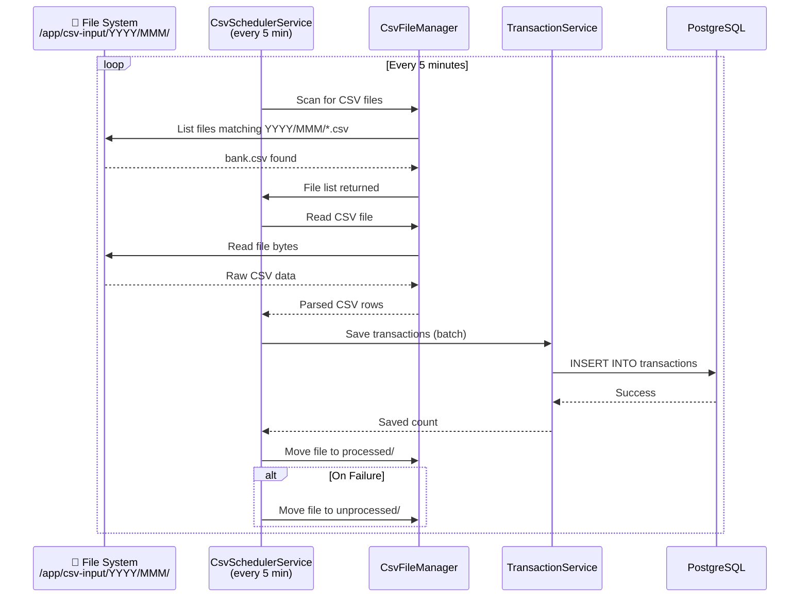

# Monthly Expense Tracker - Architecture Diagram

## 0. End-to-End Data Pipeline (CSV Preprocessor → Expense Tracker)

```mermaid
flowchart LR
    subgraph Preprocessor["🐍 CSV Preprocessor (External Project)"]
        direction TB
        RAW["📁 Raw Bank CSV Files<br/>(TransHist / CommBank format)"]
        FIND["find_csv_files()<br/>skip *_Processed.csv"]
        FMT["detect_file_format()<br/>headers / no headers"]
        OUT["determine_output_format()<br/>TransHist vs CommBank columns"]
        CLEAN["clean_date()<br/>clean_amount()"]
        CAT["categorize()<br/>keyword → category"]
        FILT["Filter<br/>amount ≤ 0, missing fields<br/>is_excluded()"]
        PROC["📄 {name}_Monthly_Processed.csv"]
        SUM["Print Summary<br/>rows, total, top categories"]

        RAW --> FIND --> FMT --> OUT --> CLEAN --> CAT --> FILT --> PROC --> SUM
    end

    subgraph Tracker["💰 Monthly Expense Tracker"]
        direction TB
        VOL["📁 /app/csv-input/YYYY/MMM/"]
        SCHED["CsvSchedulerService<br/>(every 5 min)"]
        DB["PostgreSQL<br/>transactions table"]
        API["Spring Boot REST API"]
        UI["React Dashboard<br/>Charts & Tables"]

        VOL --> SCHED --> DB --> API --> UI
    end

    PROC -->|"Copy to input folder"| VOL

    style Preprocessor fill:#fff8e1,stroke:#F57F17
    style Tracker fill:#e8f5e9,stroke:#2E7D32
```

---

## 1. Overall System Architecture

---

## 2. Backend Internal Architecture

---

## 3. Frontend Component Architecture

---

## 4. Kubernetes / Helm Deployment Architecture

---

## 5. Data Flow: CSV Import Pipeline

---

## 6. Technology Stack Summary

| Layer | Technology | Version | Purpose |
|-------|-----------|---------|---------|
| **Frontend** | React | 18.2.0 | SPA UI framework |
| **Frontend** | Bootstrap | 5.2.3 | CSS component library |
| **Frontend** | Chart.js | 4.2.1 | Data visualization |
| **Frontend** | Axios | 1.3.4 | HTTP client |
| **Web Server** | Nginx | Alpine | Static files + reverse proxy |
| **Backend** | Java | 11 | Runtime |
| **Backend** | Spring Boot | 2.7.14 | REST API framework |
| **Backend** | Spring Data JPA | 2.7.14 | ORM / data access |
| **Backend** | OpenCSV | 5.6 | CSV parsing |
| **Backend** | ShedLock | 4.44.0 | Distributed scheduler lock |
| **Backend** | Lombok | latest | Boilerplate reduction |
| **Database** | PostgreSQL | 17 | Production database |
| **Database** | H2 | embedded | Local development |
| **Container** | Docker | 3.8 | Containerization |
| **Orchestration** | Kubernetes | - | Container orchestration |
| **Package Mgr** | Helm | - | K8s application packaging |
| **Build** | Maven | 3.x | Backend build tool |
| **Build** | npm / react-scripts | 5.0.1 | Frontend build tool |
| **CI/CD** | GitHub Actions | - | Automated workflows |
